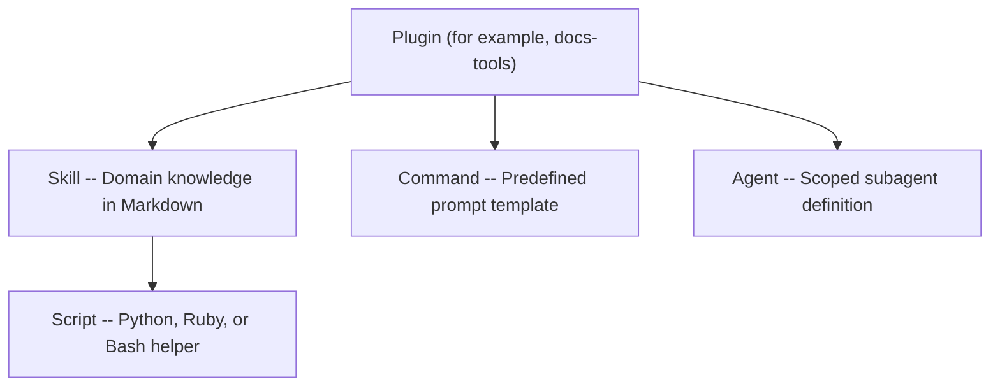

# What are agent tools?

Red Hat Docs Agent Tools give AI coding assistants structured domain knowledge about Red Hat documentation standards, workflows, and tooling. The tools take the form of reusable Markdown files that you load into Claude Code or Cursor so that the assistant can apply style rules, run reviews, orchestrate documentation workflows, and prepare content for publishing -- all without you needing to paste lengthy instructions into every prompt.

## What agent tools do for documentation writers

Documentation writers follow style guides, run checklists, coordinate with JIRA tickets, and perform repetitive cleanup tasks across many files. Agent tools encode that knowledge into files that an AI assistant reads and follows on your behalf. When you load a skill file into a chat session, the assistant gains the ability to review your AsciiDoc against the Red Hat Supplementary Style Guide, assess content quality using a multi-parameter scorecard, or walk through an end-to-end documentation workflow from requirements analysis to style review.

The key benefits for writers:

- **Consistency** -- The assistant applies the same rules every time, reducing the chance of missed style violations or skipped checklist items.
- **Speed** -- Tasks that require cross-referencing multiple style guides or scanning dozens of files happen in a single prompt.
- **Repeatability** -- Any team member can load the same skill and get the same review behavior, making peer reviews more uniform.

## Available plugins

The repository organizes tools into plugins that cover style guide review, Vale linting, DITA conversion, Jobs-To-Be-Done analysis, content quality assessment, and more. See [Plugins and workflows](plugins-and-workflows.md) for descriptions of each plugin and common documentation tasks they support.

## How the pieces fit together

Each plugin can contain four types of components.

A **plugin** groups related capabilities under a single name and version. You install plugins in Claude Code with the `claude plugin` CLI or access them from a local clone in Cursor.

A **skill** encodes domain knowledge, checklists, or step-by-step instructions in a Markdown file (`SKILL.md`). Skills are the most common component. You reference them by their fully qualified name, for example `docs-tools:rh-ssg-formatting`.

A **command** defines a predefined prompt template for a common task. Commands combine multiple skills and instructions into a single invocation, for example `docs-tools:docs-review` runs a comprehensive documentation review.

An **agent** defines a subagent that the AI assistant can dispatch for a scoped task. Agents receive a focused system prompt and work independently, for example the `docs-reviewer` agent runs Vale linting and applies 18 style guide review skills.

Some skills also include **scripts** (Python, Ruby, or Bash) that perform tasks such as reading JIRA tickets, extracting article content from web pages, or reducing AsciiDoc includes.

## Choose your path

Select the guide that matches how you plan to use the tools.

**Cursor users** -- Read [Get started with Cursor](cursor.md) to learn how to clone the repository, attach skills, and set up your workspace.

**Claude Code users** -- Read [Get started with Claude Code](claude-code.md) to add the marketplace and install plugins from the terminal.
